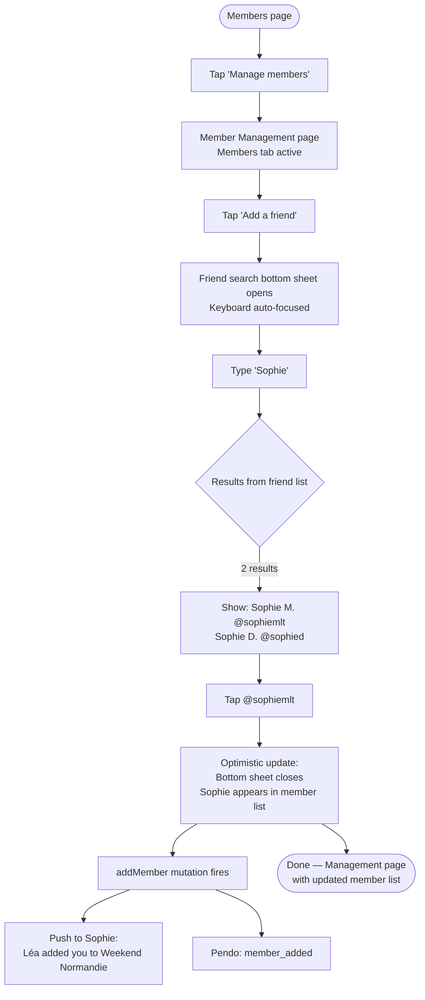
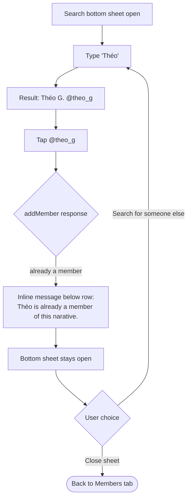
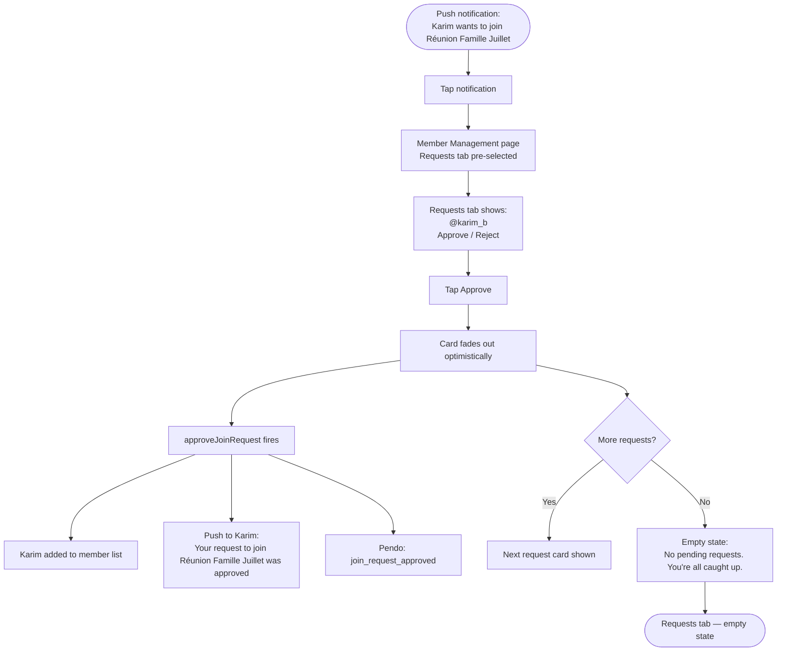
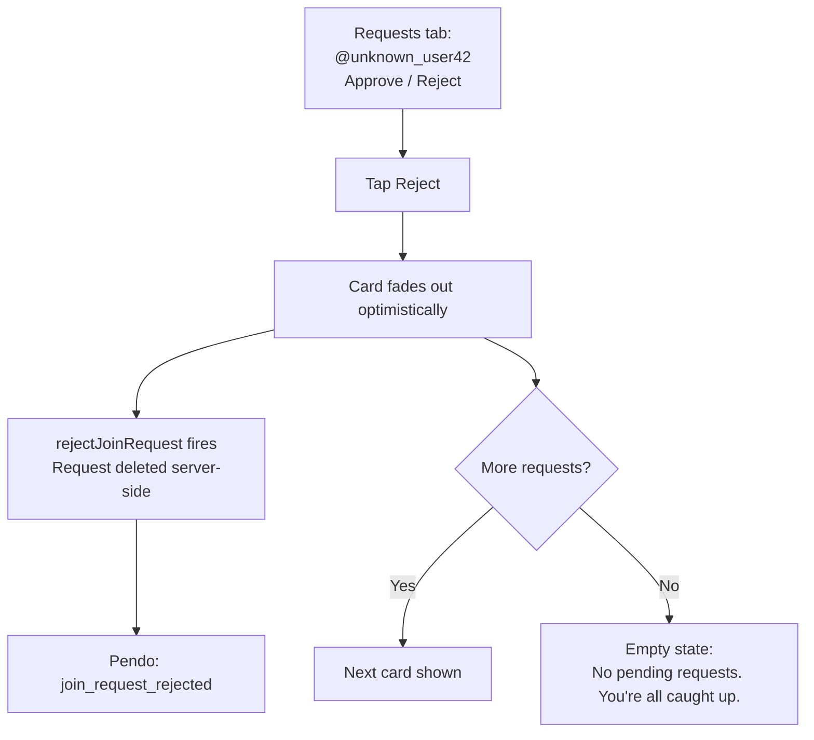
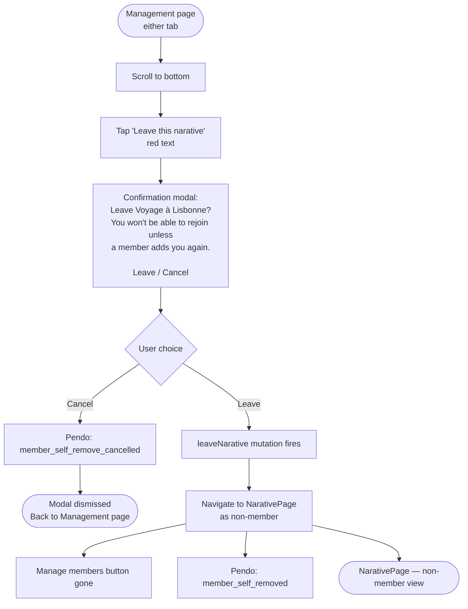
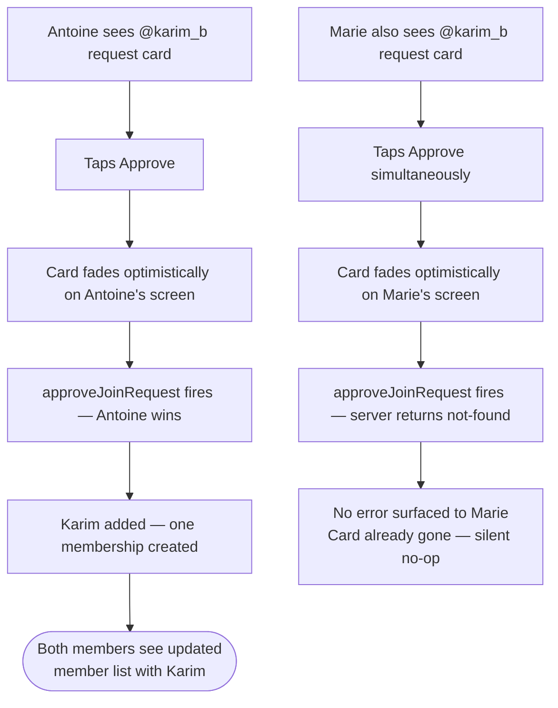

# UX Design Specification — Narative Member Management

**Author:** Matthieu
**Date:** 2026-04-13
**Linear:** NAR-461

---

<!-- UX design content will be appended sequentially through collaborative workflow steps -->

## UX Discovery

### Project Vision

The Narative Member Management feature gives every narative member a single, dedicated space to control who belongs to their shared memory. It replaces out-of-app coordination and an orphaned join request system with a clean, democratic management page where any member — not just a creator — can invite friends, respond to join requests, and leave gracefully. The feature embodies Nara's core philosophy: the memory belongs to everyone in it equally.

### Target Users

All narative members — equal, regardless of who created the narative. Three behavioral modes:
- **The inviter (Léa):** Remembers someone who should have been there. Wants to add quickly, one tap, no friction.
- **The gatekeeper (Antoine):** Receives a push when someone requests access. Opens the Management page to decide — approve or reject with full context (avatar, username).
- **The leaver (Camille):** Wants to quietly exit a narative she's no longer part of. Needs a clear, low-drama self-remove path with honest consequences.

### Key UX Design Challenges

1. **Democratic interface, no hierarchy signals** — No admin badge, no special affordances for "the person who created this". Every member sees an identical Management page.
2. **Scoped search that feels like a feature** — Friend-list-only search is a trust decision, not a limitation. UX must frame it as "invite someone you already know in Nara" — never surface a "no results" that makes users feel restricted.
3. **Calibrated confirmation weight** — Three action types with different destructiveness: add (no modal), reject (no modal), leave (confirmation required). Must feel intuitive, not arbitrary.
4. **Multi-section state coherence** — Member list + Pending requests = two independent data sections. Each needs Loading / Empty / Error / Populated states that look and feel designed together.
5. **First-actor-wins graceful degradation** — If a request card disappears because another member acted first, the UI must handle that silently (stale card fades, no error).

### Design Opportunities

1. **Pending request badge as warm invitation signal** — On the "Manage members" button: treat the badge not as an alert but as a warm prompt. "Someone wants to join your memory."
2. **Friend search as a moment of care** — Adding someone to your narative is an act of inclusion. Search results should show name + avatar, making the interaction feel human and intentional.
3. **Leave modal as an honest farewell** — Nara's voice should come through in the confirmation copy. Warm, honest, no drama — explains the consequence (can't rejoin alone) without alarm.
4. **Real-time member list** — When a friend is added or a request approved, the member list updates immediately. This creates a satisfying confirmation loop — the UI reflects reality without a refresh.

---

## Core User Experience

### Defining Experience

The defining interaction of Member Management is the **friend add flow**: a narative member thinks of someone who should be there, searches their name, sees their face, and adds them with one tap. No confirmation, no waiting — the friend relationship *is* the approval. Every other interaction on the Management page (request validation, self-remove) is secondary to this core loop.

### Platform Strategy

- **React Native (Expo) — iOS + Android, portrait-only**
- Touch-based exclusively — no keyboard/mouse affordances needed
- Offline: management mutations require network; member list may show Apollo-cached stale data with a refresh indicator
- Push notifications: three distinct triggers (member added, new request, request approved) — all must deep-link back to the narative
- No new native modules, no new permissions beyond existing push consent

### Effortless Interactions

- **Add a friend:** Search → result appears → one tap → member added → list updates. Zero intermediate steps.
- **Approve a request:** Badge on button draws attention → tap Manage → card visible → tap Approve → done. Push notification closes the loop for the requester automatically.
- **Self-remove:** Tap "Leave" → modal with honest copy → tap "Leave" to confirm → immediate state transition back to NarativePage as non-member.
- **Request badge:** Members never need to hunt for pending requests — the badge on the "Manage members" button tells them exactly how many are waiting.

### Critical Success Moments

1. **First friend search:** Léa types "Sophie" — her friend list returns two results with avatars. She recognises `@sophiemlt` immediately. One tap. Sophie appears in the member list. The narative is now complete.
2. **Request approval loop:** Antoine receives a push notification, opens the Management page, sees Karim's request card (avatar + username), taps Approve. Karim gets a notification within 5 seconds. The request card disappears. Antoine is done.
3. **Leave confirmation that doesn't punish:** Camille taps "Leave this narative". The modal copy reads: *"Leave Voyage à Lisbonne? You won't be able to rejoin unless a member adds you again."* Honest. Not scary. One more tap and she's out.

### Experience Principles

1. **Friends as trust tokens** — The friend relationship replaces confirmation modals, consent flows, and invite approvals. If you're friends on Nara, you're trusted to join a narative. Design never second-guesses this.
2. **Actions resolve immediately** — Every mutation (add, approve, reject, leave) updates the UI in real time. No spinner-then-refresh pattern. The screen reflects the new state before the user moves on.
3. **Calibrated friction** — Rejection requires zero confirmation (not your memory being protected). Adding requires zero confirmation (friend trust). Leaving requires one confirmation (you're removing yourself — that's irreversible without help). Friction matches stakes.
4. **Warm system voice** — Push notification copy, empty state copy, confirmation modal copy — all in Nara's voice: personal, warm, named ("Léa added you to Weekend Normandie" not "You have been added to a group").
5. **States as first-class citizens** — Every section has a designed state for Loading, Empty, Error, and Populated. No unmapped states reach the user.

---

## Desired Emotional Response

### Primary Emotional Goals

| Moment | Target Emotion | What it means |
|--------|----------------|---------------|
| Opening the Management page | Calm confidence | "I have everything I need to manage this." No overwhelm, no confusion. |
| Adding a friend | Care delivered | "I thought of you and brought you here." Not form-filling — an act of inclusion. |
| Approving a join request | Warmth of welcome | Opening a door. The requester wanted in; you let them in. |
| Rejecting a request | Quiet authority | Firm but undramatic. No guilt, no fanfare. Just a decision made. |
| Self-removing | Honest closure | A choice respected. Not a punishment, not an error state. |
| Receiving "you were added" push | Surprise and belonging | The named notification makes it personal: Léa thought of you specifically. |

### Emotional Journey Mapping

**Discovery (first time reaching Management page):**
- Enters via the "Manage members" button — already framed as an act of stewardship
- Emotion: *curiosity + ownership* — "this is mine to manage"
- Badge on button primes them: something is waiting

**During the core action (search + add / approve / reject):**
- Emotion: *purposeful flow* — clear affordances, no hesitation points
- Results appear instantly, actions resolve immediately — the UI responds like a trusted tool

**After completing an action:**
- Emotion: *quiet satisfaction* — the list updated, the card disappeared, the job is done
- No celebratory splash screen — that would cheapen the intimacy

**If something goes wrong (offline, duplicate, stale request):**
- Emotion: *informed, not alarmed* — "I understand what happened and what to do next"
- Inline errors, not modal alerts; soft language, not system error tone

**On return visits:**
- Emotion: *habitual trust* — the page feels familiar and reliable
- Badge builds anticipation; member list feels like home

### Micro-Emotions

| Emotion Pair | Target State | Design Mechanism |
|---|---|---|
| Confidence vs. Confusion | Confidence | Single-purpose sections; clear hierarchy; no hidden actions |
| Trust vs. Skepticism | Trust | Friend-scoped search visually indicated; warm empty states |
| Accomplishment vs. Frustration | Accomplishment | Real-time UI updates confirm every action instantly |
| Belonging vs. Isolation | Belonging | Named push notifications; avatar-forward request cards |
| Calm vs. Anxiety | Calm | No confirmation modals on approve/reject; leave modal is reassuring not alarming |
| Delight vs. Satisfaction | Satisfaction (not delight) | This is a management flow, not an achievement moment — satisfaction is the right register |

### Design Implications

- **Warm, not clinical** → Avoid table-style layouts, checkbox lists, modal-heavy flows. Use card-based UI with faces (avatars) prominent.
- **Named over anonymous** → Every notification, empty state, and action result references names: "Léa added you to Weekend Normandie", not "A member was added."
- **Instant feedback** → Apollo optimistic updates where possible — the list updates before the server confirms, creating a feeling of zero latency.
- **No horror vacui** → Empty states (no pending requests, no search results yet) should be warm and explanatory, not blank. They tell a story: "Your narative is all caught up."
- **Confirmation copy as Nara voice** → The leave modal is the highest-stakes copy moment. It should feel like a friend saying "Are you sure?" — not a legal disclaimer.

### Emotional Design Principles

1. **Every action is an act of care** — Adding, approving, even leaving — frame all interactions as intentional human choices, not system operations.
2. **Named makes it real** — Use actual names (member names, narative titles) everywhere. Anonymous system language kills intimacy.
3. **Satisfaction over delight** — This is a management screen, not a celebratory moment. Aim for quiet satisfaction: "Done. Good." Not confetti.
4. **Errors inform, never alarm** — Inline, soft, explanatory. The system never makes users feel they broke something.
5. **Empty is not empty** — Empty states carry meaning: a narative with no pending requests is a peaceful narative. Design that message in.

---

## UX Pattern Analysis & Inspiration

### Inspiring Products Analysis

#### 1. WhatsApp — Group member management
**What they do well:**
- Contact-picker search is instant and scoped to your contacts list — users never feel like they're searching a void
- Adding someone to a group is one tap from search results: avatar + name, tap, done
- Admin model (any admin can add/remove) maps closely to Nara's equal-access model
- Group info page cleanly separates "Members" section from "Actions" (exit group, mute)

**Applicable patterns:**
- Contact-scoped search with avatar + display name = minimal decision load
- "Exit group" as a distinct destructive action at the bottom of a settings-style page, clearly separated from member operations
- Real-time member list update after add — no refresh required

**What to avoid from WhatsApp:**
- The dense, list-heavy member section — too utilitarian for Nara's warmth
- Admin-only affordances that create hierarchy signals (Nara has no hierarchy)

---

#### 2. BeReal — Friend-based social, warmth-first UX
**What they do well:**
- Every interaction is framed around named people, not accounts — "Léa posted" not "1 new post"
- Notifications are personal and direct: "[Name] reacted to your BeReal" — always named
- Empty states are copy-driven and warm: "It's time to BeReal" — not blank screens
- Actions are immediate, visual feedback is snappy — no loading spinners on social interactions

**Applicable patterns:**
- Named-first notifications and copy everywhere
- Warm, conversational empty state copy
- Fast, optimistic UI updates — the UI reacts before the server confirms
- Minimal chrome; faces and names dominate the screen

---

#### 3. Polarsteps — Travel memory, collaborative contributions
**What they do well:**
- Travel "trip" membership is presented as a crew — avatars in a row, every face visible
- Join requests handled gracefully: request sent → confirmation screen → waiting state
- The app treats membership as emotional (you're going on this trip together) not administrative
- Leave flow is quiet and consequential — confirmation modal references what you'll lose access to

**Applicable patterns:**
- Avatar-row member display = emotional, not administrative
- Join request as a personal moment: show avatar + username, make the decision feel human
- Leave confirmation copy that references consequences without alarming

---

#### 4. Telegram — Group management edge cases done right
**What they do well:**
- Request cards in group join flows show avatar + username with Approve/Reject inline
- First-actor-wins in admin groups: once one admin acts, request disappears for others
- Leave confirmation modal is calm and informational: "Leave [Group]? You won't receive messages anymore."
- Reject is instant, no confirmation — the request simply disappears

**Applicable patterns:**
- Inline Approve/Reject on request cards — no navigation away
- Silent first-actor-wins: request card disappears cleanly when acted on by another member
- Leave modal copy: honest about consequences, no alarm
- Rejection = immediate disappear, no state change, no notification to requester

---

### Transferable UX Patterns

**Navigation Patterns:**
- **Bottom sheet for search (WhatsApp, iMessage)** — friend search opens as a bottom sheet over the Management page, not a new screen. Keeps the user anchored in context.
- **Sections with clear visual weight (Polarsteps)** — Member list at top (primary), Pending Requests below (secondary), Leave action at bottom (destructive, separated).

**Interaction Patterns:**
- **One-tap add from search result (WhatsApp)** — tap the search result row = add immediately. No "Add" button to find.
- **Inline approve/reject on card (Telegram)** — action buttons embedded in the request card. No tap-to-expand-to-action pattern.
- **Optimistic UI update (BeReal)** — member list updates instantly on add; request card disappears instantly on approve/reject. Server confirms in background.
- **Silent stale-card removal (Telegram)** — if another member acts first, the card fades/disappears without an error state.

**Visual Patterns:**
- **Avatar-forward cards (Polarsteps, BeReal)** — faces first, usernames second. Makes every member/requester feel like a real person.
- **Separated destructive action (WhatsApp, Telegram)** — "Leave this narative" visually separated from the member management section. Never grouped with add/approve/reject actions.
- **Badge as number, not dot (WhatsApp)** — pending count as a number badge on the entry button, not a generic red dot.

### Anti-Patterns to Avoid

1. **Confirmation modal on add** — WhatsApp doesn't do it, Telegram doesn't do it. Friend trust is the approval. A modal breaks flow and signals distrust of the user's decision.
2. **Paginated member list** — Naratives are small groups. Pagination or "load more" adds unnecessary cognitive load. Show all members.
3. **Generic error messages** — "An error occurred" on a management action leaves users stranded. Always name the action that failed and what to do next.
4. **Request rejection with confirmation modal** — Rejection is not destructive from the acting member's perspective. No modal. The card disappears; that's the feedback.
5. **Empty search = error state** — If a member types a name and no friend matches, it's not an error — it's an honest result ("No friends named 'X' in Nara"). Design it as information, not failure.
6. **Role indicators or admin badges** — Any visual signal that one member is "more" than another contradicts the feature's core premise. No crown icons, no "Creator" labels.

### Design Inspiration Strategy

**Adopt directly:**
- WhatsApp's one-tap-from-search-result add interaction
- Telegram's inline approve/reject on request cards
- BeReal's named-first notification and copy style
- Telegram's silent first-actor-wins card removal

**Adapt for Nara's warmth:**
- WhatsApp's contact picker → warmer visual treatment (larger avatars, mutual narative count as disambiguation hint in future)
- Telegram's leave modal copy → Nara's voice: conversational, not legalese
- Polarsteps' avatar-row member display → adapted for vertical scrollable list with avatars

**Avoid entirely:**
- Any admin/role hierarchy signals (WhatsApp admin crown)
- Confirmation modals on non-destructive actions
- Pagination or lazy-loading on small member lists
- Generic error copy

---

## Design System Foundation

### Design System Choice

**Evanescent** — Nara's internal design system (`@nara/evanescent/`)

This is not a decision to make — it is a project constraint. All Nara features use Evanescent as the primary component source. Custom components are created only when no existing Evanescent component fits the need.

### Rationale for Selection

- **Consistency with the app:** All existing Nara screens are built on Evanescent — the Management page must match visually and behaviourally
- **No new dependencies:** No external design system to evaluate, version-pin, or customise — Evanescent is already installed and maintained
- **Nara aesthetic built-in:** Evanescent encodes Nara's warm, memory-preserving visual identity — typography, spacing, colour, and component patterns are already tuned for the product
- **Component inventory as constraint:** The Storybook layer (nara-ux Step 3–5) will map every screen to existing Evanescent components first; new components are created only for gaps

### Implementation Approach

| Layer | Tool | Rule |
|---|---|---|
| UI primitives (buttons, inputs, avatars, modals) | Evanescent (`@nara/evanescent/`) | Use first, always |
| Custom layout and composition | Emotion `styled()` | Wrap Evanescent components for layout |
| No StyleSheet | ~~StyleSheet.create()~~ | Explicitly forbidden per project context |
| i18n | `react-intl` | All copy strings — never hardcoded |
| Analytics | Pendo SDK (`rn-pendo-sdk`) | 9 events per tracking plan |

### Customization Strategy

- **Avatar component:** Use Evanescent's existing avatar — if it supports size variants, use them for member list rows vs. request cards
- **Badge:** Evanescent likely has a badge component — verify during component inventory step; if not, create `PendingBadge` as a thin wrapper
- **Request card:** Likely a composition of Evanescent avatar + typography + two action buttons — no new base component needed
- **Bottom sheet (search):** Check Evanescent for a sheet/drawer component; if absent, this is the one new primitive to create
- **Confirmation modal:** Evanescent modal/dialog component — configure with Nara copy and destructive action styling
- **Leave action row:** Evanescent list item or pressable with destructive colour token (red/warning) applied via Emotion

---

## Defining Core Experience

### The Defining Interaction

> **"Find a friend. Tap. They're in."**

The core interaction of Member Management is the **friend add flow** — the moment a member realises someone belongs in their narative and acts on it immediately. This interaction must be so natural it barely registers as a UI gesture. It's not a feature being used; it's a person being included.

If this works perfectly, everything else on the Management page is supporting context.

### User Mental Model

Users arrive at the Management page with a goal already formed: "I want to add Sophie" or "Someone requested to join — I should check." They are **not** exploring. They are executing a decision they've already made.

**What they bring:**
- A name (or face) in mind — not a search query to form
- Confidence in the action — they've already decided. The UI just executes.
- Zero patience for confirmation steps — they know what they want

**What breaks the mental model:**
- Searching globally (why isn't my friend showing up?)
- A confirmation modal ("I just said I wanted to add them")
- A loading state with no optimistic feedback ("did it work?")
- A result card that doesn't show enough to distinguish two Sophies

**Mental model alignment:**
The friend-scoped search maps perfectly to the user's mental model: "I want to add someone I know." The scope restriction *is* the mental model — users expect to search their friends, not all of Nara. The UI should never surface this as a limitation.

### Success Criteria for the Core Interaction

| Criterion | Target |
|---|---|
| Time from opening search to add complete | ≤ 5 seconds |
| Taps required | ≤ 2 (open search + tap result) |
| User confidence at result display | High — avatar + name visible, no ambiguity |
| Feedback on success | Immediate — member list updates before server response |
| Error recovery | Inline, named — "Sophie is already a member" — no modal |

**Users say "this just works" when:**
- They type 3 characters and see the right face
- They tap once and the member list updates instantly
- They don't think about the UI at all — they only think about Sophie

### Pattern Analysis: Established + Adapted

This interaction uses **established contact-picker patterns** (WhatsApp, iMessage) adapted for Nara's warmth and friend-scoping:

| Pattern | Source | Nara Adaptation |
|---|---|---|
| Bottom sheet search overlay | WhatsApp, iMessage | Warmer: larger avatars, soft background |
| Avatar + display name in results | All contact pickers | Add username as secondary line for disambiguation |
| One-tap from result row | WhatsApp | No difference — adopt directly |
| Real-time optimistic update | BeReal, WhatsApp | Apollo optimistic response — list updates pre-server |
| Inline duplicate error | WhatsApp | Named: "Sophie is already a member" not generic |

No novel patterns required. This is a proven flow in a new emotional context.

### Experience Mechanics — Friend Add Flow

**1. Initiation:**
- User opens Member Management page
- Taps "Add a friend" action (prominent, above member list or as a floating/sticky action)
- A bottom sheet slides up with a search field auto-focused (keyboard appears)

**2. Search interaction:**
- User types username, first name, or last name
- Results appear debounced (≤ 300ms after typing stops) — scoped to their friend list
- Each result row: avatar (left) + display name (bold) + @username (secondary) + a chevron or "Add" affordance (right)
- Empty results: warm copy — "No friends with that name in Nara. Try their username."
- Loading state: skeleton rows matching result layout

**3. System response on tap:**
- Result row tap triggers `addMember` mutation
- Optimistic update: bottom sheet closes, member list scrolls to show new member (fade-in animation)
- If duplicate: bottom sheet stays open, inline message below the tapped row — "Sophie is already a member"
- If offline: inline banner — "You're offline. Connect to add members."

**4. Completion:**
- Member list reflects the new member immediately
- Push notification fires to the added user (server-side, silent on client)
- Pendo event fires: `member_added`
- User is back on the Management page, action complete — no toast, no celebration, just the updated list

### Experience Mechanics — Join Request Flow

**1. Initiation:**
- Push notification arrives: "[Name] wants to join [Narative name]"
- Badge appears on "Manage members" button (or pre-existing badge if already shown)
- User opens Management page — Pending Requests section is visible with count

**2. Decision interaction:**
- Request card: avatar (left) + @username (prominent) + "Approve" button (primary) + "Reject" button (secondary/text)
- No tap-to-expand — all decision information is on the card face
- Cards ordered by recency (newest first)

**3. System response:**
- **Approve:** Card fades out immediately (optimistic); `approveJoinRequest` fires; new member appears in member list; push to requester fires server-side
- **Reject:** Card fades out immediately (optimistic); `rejectJoinRequest` fires; no notification to requester
- **Stale card (first-actor-wins):** If another member acted first, server returns "not found" — card was already removed optimistically; no error surfaced to user

**4. Completion:**
- Empty requests section shows: "All caught up — no pending requests."
- Pendo event fires: `join_request_approved` or `join_request_rejected`

### Experience Mechanics — Self-Remove Flow

**1. Initiation:**
- "Leave this narative" action — visually separated at the bottom of the Management page
- Destructive colour (red/warning token) — distinguishes from all other actions

**2. Confirmation:**
- Modal opens: title "[Narative name]", body "You won't be able to rejoin unless a member adds you again.", two buttons: "Leave" (destructive) and "Cancel" (dismiss)
- Pendo: if cancelled → `member_self_remove_cancelled`

**3. System response:**
- `leaveNarative` mutation fires
- User is navigated back to NarativePage — now as a non-member
- "Manage members" button no longer visible
- Management page no longer accessible

**4. Completion:**
- Pendo: `member_self_removed`
- No notification to remaining members (v1)
- Content the user contributed stays in the narative

---

## Visual Design Foundation

### Brand Guidelines

Nara's visual identity is defined and encoded in the **Evanescent design system** (`@nara/evanescent/`). The Management page inherits all visual decisions from the existing system — no new visual language is introduced.

**Visual character:** Warm, personal, memory-preserving. Closer to a journal or photo album than a utility dashboard. Soft, not clinical. Human faces (avatars) dominate over abstract UI chrome.

### Color System

All colours come from Evanescent design tokens — no raw hex values in component code.

| Role | Token (assumed) | Application |
|---|---|---|
| Primary action | `color.primary` | "Add a friend" CTA, Approve button |
| Destructive action | `color.danger` / `color.error` | "Leave this narative" row, Leave button in modal |
| Secondary action | `color.secondary` or text-only | Reject button (subdued — rejection is quiet) |
| Surface / background | `color.surface` | Management page background, bottom sheet background |
| Card background | `color.card` or `color.elevated` | Request cards, member rows |
| Muted text | `color.textSecondary` | @username secondary line, empty state copy |
| Badge background | `color.danger` or warm accent | Pending request count badge |

**Accessibility:** Evanescent tokens are expected to meet WCAG AA contrast requirements. Any custom Emotion overrides must preserve contrast ratios (minimum 4.5:1 for body text, 3:1 for large text/icons).

### Typography System

Evanescent's type scale is inherited. Application rules for this feature:

| Text role | Style | Usage |
|---|---|---|
| Page title | Heading / Large | "Manage members" screen header |
| Section header | Subheading | "Members", "Pending Requests" section labels |
| Member name | Body / Bold | Primary text in member rows and request cards |
| Username (@handle) | Body / Regular / Muted | Secondary line in search results and request cards |
| Action labels | Label / Medium | "Add a friend", "Leave this narative" |
| Empty state | Body / Muted | "No pending requests", search empty states |
| Modal body copy | Body / Regular | Leave confirmation — warmest, most human copy in the feature |

**Typography principle:** Names are always displayed in the boldest weight available for their context. The username (@handle) is always secondary — people think in names, not handles.

### Spacing & Layout Foundation

| Principle | Rule |
|---|---|
| Base spacing unit | 8px (assumed Evanescent default) |
| Screen padding | 16px horizontal on all sections |
| Section separation | 24px between Member list / Pending Requests / Leave action |
| Card internal padding | 12px vertical, 16px horizontal |
| Avatar size — member list rows | 36–40px |
| Avatar size — request cards | 48–52px (decision-making context needs larger faces) |
| Avatar size — search results | 44px (between the two — action context) |
| Bottom sheet min-height | 50% screen height; expands with keyboard |

**Layout philosophy:** Spacious, not dense. Naratives are small groups — the member list will rarely exceed 10–15 rows. No need to compress. Give each member their own breathing room.

**Section order on Management page (top to bottom):**
1. Header ("Manage members" + back navigation)
2. "Add a friend" CTA — prominent, first action
3. Members section (with count) — scrollable list
4. Pending Requests section (with count badge) — visible when requests exist; hidden or minimal when empty
5. "Leave this narative" — red, separated, at the bottom. Visual separation (divider or significant margin) from the sections above.

### Accessibility Considerations

- **Touch targets:** All tappable rows minimum 44×44pt (iOS HIG + Android Material minimum)
- **Approve/Reject buttons on request cards:** Minimum 44pt height each; adequate spacing between them to prevent mis-taps
- **Modal focus trap:** Leave confirmation modal traps focus — only "Leave" and "Cancel" reachable by assistive technology while open
- **Avatar alt text:** Every avatar image has an accessible label: "[Name]'s profile photo"
- **Badge:** Pending count badge has accessible label: "[N] pending join requests"
- **Empty states:** Readable by screen readers — not image-only
- **Error states:** Inline error messages associated with their context via accessibility labels
- **Destructive action colour:** "Leave this narative" must not rely on colour alone — text label and visual separation also signal destructiveness

---

## Design Direction Decision

### Design Directions Explored

Three layout directions were evaluated:
- **A — Single Scrollable Page:** All sections (Add, Members, Requests, Leave) on one vertically scrollable screen
- **B — Segmented Control:** Members tab (add + list) / Requests tab (pending + badge), Leave at bottom of both tabs
- **C — Modal Sheet for Requests:** Main page shows members + add; requests open as a modal sheet from a header button

### Chosen Direction

**Direction B — Segmented Control (Tabs)**

Two tabs managed by Evanescent's existing segmented control component:
- **Members tab:** "Add a friend" CTA + member list + "Leave this narative" at bottom
- **Requests tab:** Pending request cards (with badge showing count) + "Leave this narative" at bottom

Badge lives on the Requests tab label — clear, persistent, unobtrusive.

```
┌─────────────────────────────┐
│  ← Manage members           │
├──────────────┬──────────────┤
│   Members    │  Requests ①  │  ← Evanescent SegmentedControl
├──────────────┴──────────────┤
│                             │
│  [+ Add a friend]           │
│                             │
│  MEMBERS (4)                │
│  🧑 Léa Martin              │
│  🧑 Antoine B.              │
│  🧑 Sophie M.               │
│  🧑 Théo G.                 │
│                             │
├─────────────────────────────┤
│  Leave this narative        │  ← Persistent on both tabs
└─────────────────────────────┘
```

### Design Rationale

- **Evanescent SegmentedControl component exists** — zero new navigation primitives, no custom tab implementation
- **Clean separation of concerns:** "Managing the group" (Members tab) vs. "Handling the door" (Requests tab) — two distinct mental modes, now explicitly separated
- **Badge on tab label** = always-visible pending count without cluttering the Members view
- **Scalable:** If a narative receives multiple requests, the Requests tab handles them in isolation — no long-scroll mixed with member list
- **Leave action** is pinned at the bottom of both tabs — always reachable regardless of active tab
- **PRD compliance:** ≤ 3 taps to act on a request: open page → tap Requests tab (if not already active) → tap Approve = 3 taps max; from notification deep-link → Requests tab pre-selected = 2 taps

### Implementation Approach

**Screen structure:**

Navigation header: back chevron + "Manage members" title

**Members tab (default):**
1. "Add a friend" action row → opens friend search bottom sheet
2. "Members (N)" section header
3. Scrollable member list (avatar + name rows)
4. Visual break
5. "Leave this narative" destructive action row

**Requests tab:**
1. Badge count summary: "N pending request(s)"
2. Request cards (avatar + @username + Approve / Reject inline)
3. Empty state: "No pending requests. You're all caught up."
4. Visual break
5. "Leave this narative" destructive action row

**Component:** Evanescent SegmentedControl — use as-is, no customisation needed. Badge on tab label via existing badge prop (if available) or Emotion wrapper.

**Deep-link behaviour:** Push notification for new join request → opens Management page with Requests tab pre-selected.

---

## User Journey Flows

### Journey 1 — Léa adds a friend (Primary Happy Path)

**Entry:** Members page → "Manage members" button (members only, no badge — no pending requests)



**States covered:** Loading (skeleton search rows), Populated (results), Success (list update)
**Taps to complete:** 2 (Add a friend → tap result)

---

### Journey 2 — Duplicate add attempt (Edge Case)

**Entry:** Same flow as Journey 1, but target is already a member



**States covered:** Inline error (no modal, no toast, no navigation)
**Copy:** "Théo is already a member of this narative." — named, warm, not alarming

---

### Journey 3 — Karim requests to join, Antoine approves

**Entry:** Push notification → deep link to Management page, Requests tab pre-selected



**States covered:** Populated (request card), Success (fade-out + empty state)
**Taps to complete:** 1 (from pre-selected Requests tab) or 2 (if Requests tab not active)

---

### Journey 4 — Request rejection (Edge Case)

**Entry:** Management page, Requests tab



**No confirmation modal.** Rejection is not destructive from the acting member's perspective.
**No notification to requester** (v1 — silent rejection by design).

---

### Journey 5 — Camille self-removes (Self-Remove)

**Entry:** Either tab — "Leave this narative" is pinned at the bottom of both



**Copy (modal body):** "You won't be able to rejoin unless a member adds you again." — honest, not punitive.
**Post-leave state:** NarativePage visible but Management page inaccessible; narative content intact.

---

### Journey 6 — First-actor-wins (Concurrent Approval Edge Case)

**Entry:** Two members both see the same request card



**No error state shown to Marie.** The optimistic update already removed her card — the server's not-found is swallowed silently.

---

### Journey Patterns

**Navigation pattern:** Management page is always accessed via "Manage members" button on the Members page — never directly navigable. Deep links from push notifications route to Management page with the appropriate tab pre-selected.

**Feedback pattern:** Every successful mutation produces an immediate visual change (card fade-out, list update) before server confirmation. No explicit success toast or banner — the UI change *is* the feedback.

**Error pattern:** All errors are inline, named, and contextual. No modal alerts for errors. Copy always references the specific person or action ("Théo is already a member" not "Duplicate entry").

**Empty state pattern:** Every section has a warm, explanatory empty state. Empty ≠ broken. "No pending requests. You're all caught up." — affirmative, not neutral.

**Destructive action pattern:** Only "Leave this narative" requires confirmation. All other mutations are immediate. The confirmation modal uses Nara's voice: honest about consequences, not alarming.

### Flow Optimisation Principles

1. **Default tab = Members** — the most common reason to open Management is to add someone or view the list. Requests tab is secondary, surfaced by badge.
2. **Requests tab pre-selected on push notification tap** — removes the tab-switching step from the most common request-handling flow.
3. **Optimistic updates everywhere** — all mutations update the UI before server response. Rollback only on hard error (not first-actor-wins, which is silent).
4. **Bottom sheet for search, not new screen** — keeps the user anchored in the Management page context; closing the sheet returns them to exactly where they were.
5. **Leave always reachable** — pinned at the bottom of both tabs; never buried behind navigation.

---

## Component Strategy

### Evanescent Components — Confirmed Reuse

These components exist in Evanescent and are used directly, no customisation needed:

| Component | Usage in this feature | Notes |
|---|---|---|
| `SegmentedControl` | Members / Requests tab switcher | Confirmed exists — user decision |
| `Avatar` | Member list rows, request cards, search results | Verify size variants (sm/md/lg) |
| `Modal` / `Dialog` | Leave confirmation modal | Use destructive button variant |
| `Button` (primary) | Approve action on request cards, "Add a friend" CTA | Standard primary |
| `Button` (text/secondary) | Reject action on request cards | Subdued — rejection is quiet |
| `Button` (destructive) | "Leave" in confirmation modal | Red variant |
| `TextInput` / `SearchInput` | Friend search field in bottom sheet | Auto-focused on mount |
| `ListItem` / `Row` | Member list rows, "Add a friend" row, "Leave" row | Verify pressable variant |
| `Skeleton` / `Placeholder` | Loading states for member list and search results | Match row layout |
| `Badge` | Pending request count on Requests tab label | Verify badge prop on SegmentedControl |
| `Divider` | Section separators between Members / Leave, Requests / Leave | Horizontal rule |
| `EmptyState` (if exists) | "No pending requests" and empty search copy | May need custom if absent |

### Custom Components Required

Based on gap analysis — components needed that Evanescent does not cover:

---

#### 1. `JoinRequestCard`

**Purpose:** Displays a single pending join request with inline approve/reject actions.

**Anatomy:**
```
┌──────────────────────────────────────┐
│  [Avatar 48px]  @username            │
│                 [Approve] [Reject]   │
└──────────────────────────────────────┘
```

**Props API:**
```typescript
interface JoinRequestCardProps {
  requestId: string
  username: string
  avatarUrl?: string
  onApprove: (requestId: string) => void
  onReject: (requestId: string) => void
  isLoading?: boolean  // post-action loading state
}
```

**States:**
- `default` — avatar + username + Approve / Reject buttons
- `loading` — buttons disabled, subtle spinner overlay (post-tap, pre-optimistic)
- `fading-out` — card animates out on approve/reject (optimistic removal)

**Accessibility:**
- Approve button: `accessibilityLabel="Approve join request from @username"`
- Reject button: `accessibilityLabel="Reject join request from @username"`
- Card: `accessibilityRole="article"`

---

#### 2. `FriendSearchSheet`

**Purpose:** Bottom sheet with friend search — scoped to caller's friend list. Opens from "Add a friend" row.

**Anatomy:**
```
┌──────────────────────────────────────┐
│  ──── (drag handle)                  │
│  [Search field: "Search by name..."] │
│  ─────────────────────────────────   │
│  [Avatar] Sophie M.    @sophiemlt    │
│  [Avatar] Sophie D.    @sophied      │
│  ─────────────────────────────────   │
│  (empty / loading / inline error)    │
└──────────────────────────────────────┘
```

**Props API:**
```typescript
interface FriendSearchSheetProps {
  narativeId: string
  visible: boolean
  onClose: () => void
  onMemberAdded: (userId: string) => void
}
```

**States:**
- `idle` — empty search field, no results shown
- `loading` — skeleton rows (debounced, after 300ms typing)
- `populated` — result rows with avatar + name + @username
- `empty` — "No friends with that name in Nara. Try their username."
- `inline-error` — "[Name] is already a member of this narative." below the tapped row
- `offline` — inline banner: "You're offline. Connect to add members."

**Accessibility:**
- Search field: `accessibilityLabel="Search your friends"`, auto-focused on sheet open
- Result rows: `accessibilityLabel="Add [Name] to this narative"`, `accessibilityRole="button"`

---

#### 3. `MemberRow`

**Purpose:** Displays a single narative member in the Members tab list.

**Anatomy:**
```
┌──────────────────────────────────────┐
│  [Avatar 36px]  Display Name         │
│                 @username            │
└──────────────────────────────────────┘
```

**Props API:**
```typescript
interface MemberRowProps {
  userId: string
  displayName: string
  username: string
  avatarUrl?: string
}
```

**States:**
- `default` — non-interactive (members cannot remove others in v1)
- `new` — fade-in animation on first render (when added via addMember)

**Notes:** Non-pressable in v1. If forced-removal is added in v2, this gains a pressable state.

---

### Component Implementation Strategy

**Rule:** Evanescent components first. Custom components only for genuine gaps. No wrapping Evanescent components unnecessarily.

**Emotion `styled()` usage:**
- Layout composition around Evanescent components (padding, flex, spacing)
- Animation wrappers for fade-in/fade-out (Animated.View via React Native Animated API)
- Never for base styling that Evanescent already provides

**File placement (domain architecture):**
```
mobile/src/domains/narative/view/components/
  JoinRequestCard/
    JoinRequestCard.tsx
    JoinRequestCard.stories.tsx
  FriendSearchSheet/
    FriendSearchSheet.tsx
    FriendSearchSheet.stories.tsx
  MemberRow/
    MemberRow.tsx
    MemberRow.stories.tsx
```

### Implementation Roadmap

**P0 — MVP-blocking (required for any flow to work):**
1. `MemberRow` — Members tab cannot render without it
2. `JoinRequestCard` — Requests tab cannot render without it
3. `FriendSearchSheet` — Add flow cannot work without it

**P1 — Flow-completing (required for full journeys):**
4. Evanescent `SegmentedControl` integration with badge prop
5. Leave confirmation modal (Evanescent Modal + copy)
6. Empty states for Requests tab and friend search

**P2 — Polish (enhances but doesn't block):**
7. Fade-in animation on newly added member row
8. Fade-out animation on approved/rejected request card
9. Offline banner in FriendSearchSheet

---

## UX Consistency Patterns

### Button Hierarchy

| Tier | Visual | Usage in this feature |
|---|---|---|
| Primary | Filled, brand colour | Approve (request card), "Add a friend" CTA |
| Secondary | Outlined or ghost | Cancel (leave modal) |
| Text / Quiet | Text-only, subdued colour | Reject (request card) — quiet because rejection is not the preferred action |
| Destructive | Filled or text, red/danger token | "Leave" in confirmation modal, "Leave this narative" row |

**Rule:** Never place a primary and a destructive button at the same visual weight on the same card. On request cards: Approve is primary, Reject is text — asymmetric weight reflects the preferred action.

---

### Feedback Patterns

| Situation | Pattern | Trigger | Duration |
|---|---|---|---|
| Successful mutation (add/approve/reject) | Visual state change (optimistic update) | Immediate on tap | Permanent |
| Duplicate member attempt | Inline message below result row | After mutation response | Until user dismisses / searches again |
| Offline state | Inline banner inside FriendSearchSheet | On network check | Until reconnected |
| First-actor-wins (stale card) | Silent — no feedback | Server not-found | N/A |
| Leave mutation complete | Screen navigation (back to NarativePage) | After mutation response | N/A |

**No toasts / snackbars for success states.** The UI change (list update, card removal, screen transition) is the feedback. Toast patterns are reserved for async background events — not for immediate mutations.

**No modal alerts for errors.** All errors are inline and contextual. The copy names the entity involved ("Théo is already a member") not the operation ("Error: duplicate membership").

---

### Empty State Patterns

Every data section has a defined empty state. Empty never means broken.

| Section | Empty state copy | Tone |
|---|---|---|
| Members list | *(Impossible — user is always a member)* | N/A |
| Pending Requests (Requests tab) | "No pending requests. You're all caught up." | Affirmative — peaceful narative |
| Friend search — no query | *(No empty state shown — idle state)* | N/A |
| Friend search — query with no results | "No friends named '[query]' in Nara. Try their username." | Helpful, not alarming |

**Rule:** Empty state copy must imply what to do next or reassure the user. Never a blank view or a generic "Nothing here."

---

### Loading State Patterns

| Context | Loading pattern | Constraint |
|---|---|---|
| Management page initial load | Skeleton rows matching member list layout | Show immediately; replace with real data ≤ 2s |
| Friend search results | Skeleton rows (2–3 rows) after 300ms debounce | Only show if query has been typed |
| Request card action (approve/reject) | Card remains visible, buttons disabled | Optimistic update fires immediately after |
| Mutation in-flight | No global spinner | Local state only — button disabled |

**No full-screen loading spinners.** Section-level skeletons only. The page chrome (header, tabs) is always visible.

---

### Navigation Patterns

| Action | Navigation | Back behaviour |
|---|---|---|
| "Manage members" tap (Members page) | Push → Member Management page | Back chevron → Members page |
| Push notification tap (new request) | Push → Member Management page, Requests tab pre-selected | Back chevron → wherever user was |
| "Add a friend" tap | Bottom sheet slides up (not push) | Drag down or tap outside → dismisses sheet |
| Leave confirmed | Pop → NarativePage (non-member state) | No back — user is no longer a member |
| Leave cancelled | Modal dismisses, stay on Management page | N/A |

**Rule:** "Add a friend" must not navigate away from the Management page. The bottom sheet pattern preserves context — the user is still "inside" the Management page when searching.

---

### Modal / Overlay Patterns

| Modal | Trigger | Actions | Dismiss |
|---|---|---|---|
| Leave confirmation modal | Tap "Leave this narative" | Leave (destructive) + Cancel | Cancel or tap outside |
| Friend search sheet | Tap "Add a friend" | Search + tap result | Drag down, tap outside, or add completes |

**Rule:** Modals for destructive confirmation only (leave). Bottom sheet for search context (not confirmation). Never stack — only one overlay at a time.

**Leave modal copy:**
- **Title:** "[Narative name]"
- **Body:** "You won't be able to rejoin unless a member adds you again."
- **Primary button:** "Leave" (destructive)
- **Secondary button:** "Cancel"

---

### Mutation / Optimistic Update Patterns

All mutations follow this pattern:

```
User action
  → Optimistic UI update (immediate)
  → Mutation fires (async)
  → Server confirms: no-op (success already shown)
  → Server error (non-first-actor-wins): rollback + inline error
  → Server not-found (first-actor-wins): no-op (optimistic already correct)
```

**Rule:** Never wait for server response to update the UI on happy-path mutations. Rollback only on genuine error (not race condition).

---

### Copy Voice Patterns

All user-facing copy in this feature follows Nara's voice:

| Pattern | Example — Nara voice | Example — avoid |
|---|---|---|
| Push notification | "Léa added you to Weekend Normandie" | "You have been added to a group" |
| Inline error | "Théo is already a member of this narative." | "Error: Duplicate member" |
| Empty state | "No pending requests. You're all caught up." | "No data available" |
| Leave modal body | "You won't be able to rejoin unless a member adds you again." | "Are you sure you want to leave this group?" |
| Leave modal button | "Leave" | "Confirm" or "OK" |
| Search empty | "No friends named 'X' in Nara. Try their username." | "No results found" |

**Rules:**
1. Always use real names where available (narative name, member name)
2. Present tense, direct, warm — never passive voice
3. Button labels are verbs ("Leave", "Approve", "Reject") — never nouns or confirmations ("OK", "Yes")

---

## Responsive Design & Accessibility

### Responsive Strategy

**Nara is portrait-only mobile.** There are no responsive breakpoints, no tablet layout, no desktop version. This simplifies responsive design entirely: every screen is designed for a single context — a phone held vertically.

| Platform | Strategy |
|---|---|
| iOS (iPhone) | Primary target — test on iPhone SE (375pt) through iPhone Pro Max (430pt) |
| Android | Secondary — test on common viewport widths (360dp – 412dp) |
| Tablet | Not supported — portrait-only lock means tablet layouts are never shown |
| Desktop / Web | Out of scope |
| Landscape | Not supported — Nara is portrait-locked; no landscape handling required |

**Key mobile layout concern:** The friend search bottom sheet must behave correctly when the keyboard appears. The sheet should resize (not hide behind) the keyboard — use `KeyboardAvoidingView` or bottom sheet library keyboard handling.

### Platform-Specific Considerations

| Platform | Detail | Impact |
|---|---|---|
| iOS safe areas | Home indicator area at bottom — all scroll views respect `SafeAreaView` | "Leave this narative" row must not be obscured by home indicator |
| Android back gesture | System back should dismiss bottom sheet / modal before navigating away | Handle in sheet/modal dismiss logic |
| iOS swipe back | Swipe-to-go-back on Management page should work naturally | No gesture conflicts with sheet |
| Dynamic Type (iOS) | Evanescent components should support system font size scaling | Verify avatar + text layout doesn't break at largest sizes |
| Dark Mode | Evanescent tokens should handle dark/light mode automatically | Verify custom Emotion styles use tokens, not raw hex |

### Accessibility Strategy

**Target:** WCAG 2.1 Level AA — industry standard for consumer mobile apps.

#### Touch Targets

| Element | Minimum size | Implementation |
|---|---|---|
| All tappable rows (member, search result, add CTA, leave) | 44×44pt | `minHeight: 44` on Pressable wrapper |
| Approve / Reject buttons on request card | 44pt height, adequate horizontal padding | Verify Evanescent Button meets this |
| SegmentedControl tabs | 44pt height minimum | Verify Evanescent SegmentedControl |
| Leave confirmation buttons | Full-width or min 44pt | Modal button layout |
| Bottom sheet drag handle | 44×44pt tap area (visual handle can be smaller) | Expanded hit slop |

#### Screen Reader Support (VoiceOver / TalkBack)

| Component | `accessibilityLabel` | `accessibilityRole` | `accessibilityHint` |
|---|---|---|---|
| "Manage members" button (Members page) | "Manage members, N pending requests" | `button` | — |
| SegmentedControl tabs | "Members tab" / "Requests tab, N pending" | `tab` | — |
| Member rows | "[Name], member" | `text` | — |
| "Add a friend" row | "Add a friend to this narative" | `button` | — |
| Search field | "Search your friends" | `search` | "Search by name or username" |
| Search result rows | "Add [Name], @username, to this narative" | `button` | — |
| `JoinRequestCard` | "[Name] wants to join" | `article` | — |
| Approve button | "Approve join request from [Name]" | `button` | — |
| Reject button | "Reject join request from [Name]" | `button` | — |
| "Leave this narative" row | "Leave this narative" | `button` | "You will need a member to re-add you" |
| Leave modal — Leave button | "Leave [Narative name]" | `button` | — |
| Leave modal — Cancel button | "Cancel, stay in narative" | `button` | — |
| Pending request badge | Communicated via SegmentedControl label | — | — |

#### Focus Management

- Bottom sheet open → focus moves to search field automatically (keyboard appears)
- Bottom sheet close → focus returns to "Add a friend" row
- Modal open → focus trapped inside modal (Leave + Cancel only)
- Modal close (cancel) → focus returns to "Leave this narative" row
- Post-leave navigation → focus is on NarativePage (system handles)

#### Colour Contrast

- All Evanescent colour tokens must meet 4.5:1 ratio for body text (WCAG AA)
- Destructive red ("Leave this narative" row, Leave button) must meet 3:1 for large text
- Custom Emotion `styled()` overrides: never use raw hex — always use design tokens to preserve contrast guarantees
- Reject button (text-only, muted) — verify muted colour token meets contrast threshold against card background

#### Reduced Motion

- Fade-in animation (new member row) and fade-out animation (approved/rejected card) should respect `AccessibilityInfo.isReduceMotionEnabled()`
- When reduce motion is on: skip animation, apply final state immediately

### Testing Strategy

| Test type | Tool / Method | Scope |
|---|---|---|
| Screen reader | VoiceOver (iOS) — navigate all flows by swipe only | Full journey coverage |
| Screen reader | TalkBack (Android) — navigate all flows | Full journey coverage |
| Touch target audit | Manual check + accessibility inspector | All tappable elements |
| Contrast audit | Evanescent token audit + Xcode Accessibility Inspector | All custom Emotion styles |
| Keyboard appearance | Real device — open search sheet, verify layout | iPhone SE (smallest) |
| Dynamic Type | iOS Settings → Accessibility → Larger Text → maximum | Member list + request cards |
| Dark Mode | iOS Settings → Appearance → Dark | Full feature |

### Implementation Guidelines

```typescript
// Touch target minimum
const PressableRow = styled(Pressable)`
  min-height: 44px;
  justify-content: center;
`;

// Reduced motion check
import { AccessibilityInfo } from 'react-native';
const prefersReducedMotion = await AccessibilityInfo.isReduceMotionEnabled();

// Safe area awareness
import { useSafeAreaInsets } from 'react-native-safe-area-context';
const insets = useSafeAreaInsets();
// Apply insets.bottom to scroll view content inset
```

**Rules:**
- Run `accessibilityLabel` on every interactive element — no unlabelled buttons
- Test on iPhone SE (375pt) to verify nothing breaks on smallest supported device
- Verify bottom sheet keyboard behaviour on both iOS and Android before shipping

---

## Component Mapping

### Reused from Evanescent Design System

| Screen / Section | Component | Evanescent path | Props / Usage |
|---|---|---|---|
| Tab navigation | `Tabs` + `TabList` + `Tab` | `Layout/Tabs` | `<Tab id="members">Members</Tab>` + `<Tab id="requests" count={pendingCount}>Requests</Tab>` — `count` prop IS the badge |
| Member list rows | `UserLine` | `Display/UserLine` | `firstName`, `lastName`, `profilePictureUrl`, `subtitle="@username"` — no `RightAction` (non-pressable in v1) |
| Search result rows | `UserLine` | `Display/UserLine` | `firstName`, `lastName`, `profilePictureUrl`, `subtitle="@username"`, `RightAction={<AddButton />}` |
| FriendSearchSheet wrapper | `BottomSheet` | `Layout/BottomSheet` | `isVisible`, `onClose` — `avoidKeyboard` built-in via `react-native-modal` |
| Leave confirmation modal | `Modal` | `shared/view/components/Modal` | `title`, `description`, `isVisible`, `onClose` + custom destructive button children |
| Approve button (request card) | `Button` (primary) | `Input/Button` | `variant="primary"` |
| Reject button (request card) | `Button` (text) | `Input/Button` | `variant="textGhost"` |
| Leave row + modal Leave button | `Button` (destructive) | `Input/Button` | `variant="destructive"` — verify variant name in Evanescent |
| Loading states | `Skeleton` | `Feedback/Skeleton` | Match row height of `UserLine` |
| Avatar in `JoinRequestCard` | `Avatar` | `Display/Avatar` | `size="l"` (48px) |
| Section headers | `Typography` | `Display/Typography` | `fontWeight="bold"`, `fontSize="m"` |
| Empty state copy | `Typography` | `Display/Typography` | `color="brand.subtle"`, `fontSize="s"` |
| Layout / spacing | `Box` + `Spacer` | `Layout/Box`, `Layout/Spacer` | Standard layout composition |

### New Components Required

| Component | Reason existing Evanescent insufficient | File path |
|---|---|---|
| `JoinRequestCard` | `UserLine` places RightAction horizontally — Approve/Reject need to be below the name, not inline. Custom vertical layout required. | `mobile/src/domains/narative/members/view/components/JoinRequestCard/` |
| `FriendSearchSheet` | Feature-level composition of `BottomSheet` + search `TextField` + `UserLine` list — needs its own state management and story isolation | `mobile/src/domains/narative/members/view/components/FriendSearchSheet/` |

> **`MemberRow` removed** — `UserLine` covers it directly with no customisation needed.

#### `JoinRequestCard` — Detailed Spec

```
┌──────────────────────────────────────┐
│  [Avatar l]  Display Name            │
│              @username               │
│              [Approve]  [Reject]     │
└──────────────────────────────────────┘
```

```typescript
interface JoinRequestCardProps {
  requestId: string
  firstName: string
  lastName: string
  username: string
  avatarUrl?: string
  onApprove: (requestId: string) => void
  onReject: (requestId: string) => void
  isApproving?: boolean
  isRejecting?: boolean
}
```

Stories: `Default`, `Loading` (buttons disabled), `ApprovingInFlight`, `RejectingInFlight`

#### `FriendSearchSheet` — Detailed Spec

```typescript
interface FriendSearchSheetProps {
  narativeId: string
  isVisible: boolean
  onClose: () => void
  onMemberAdded: (userId: string) => void
}
```

Stories: `Idle` (empty search), `Loading` (skeleton rows), `WithResults`, `EmptyResults`, `DuplicateError`, `Offline`
