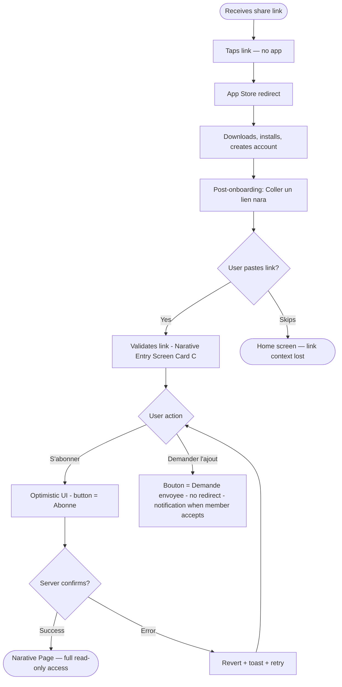
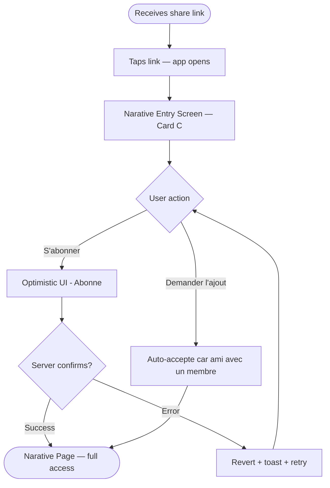
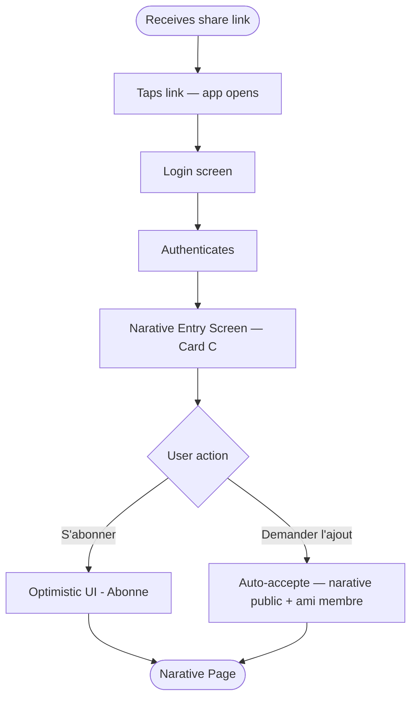
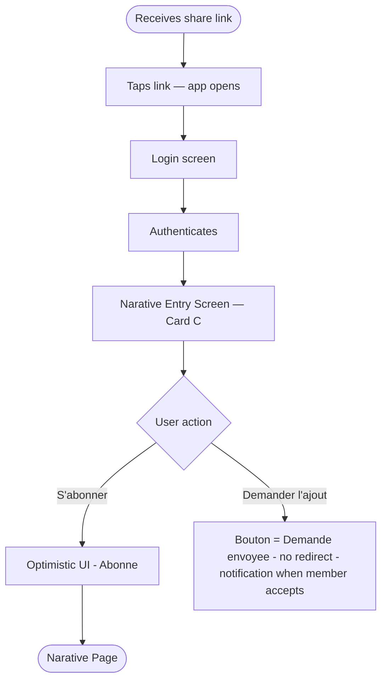
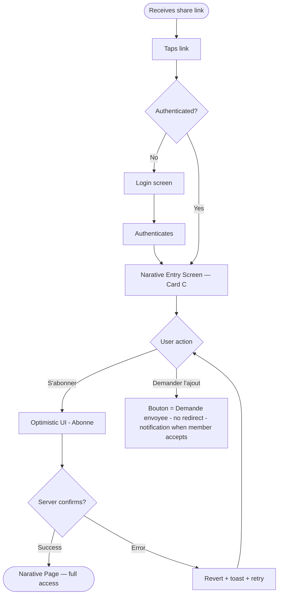
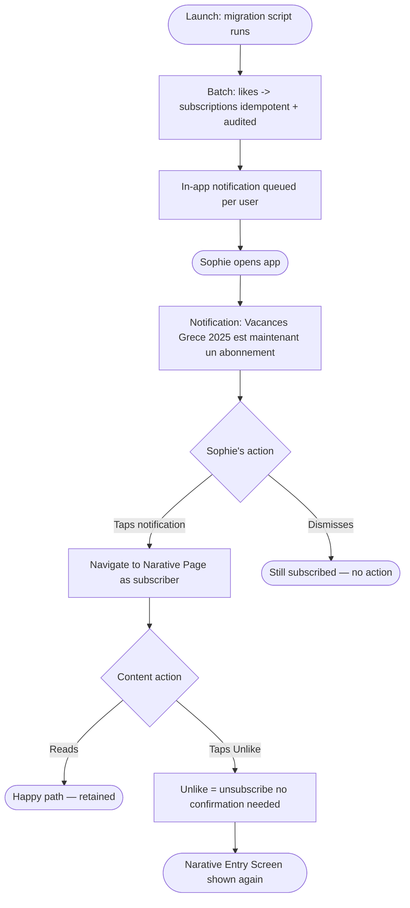
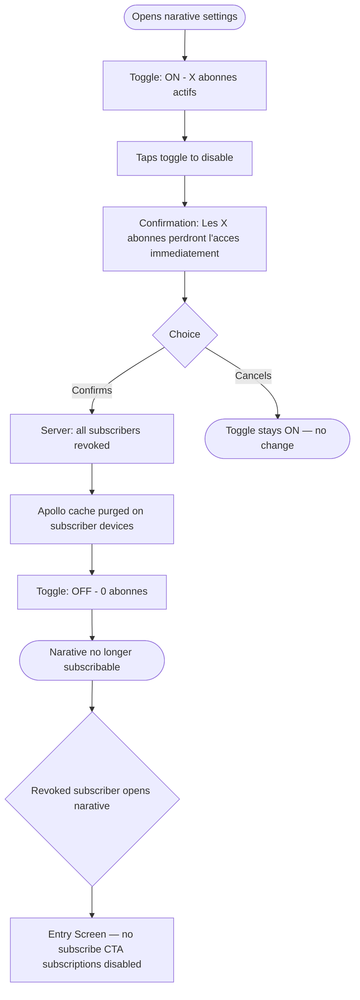

# UX Design Specification — Narative Subscription

**Author:** Matthieu
**Date:** 2026-03-28

---

<!-- UX design content will be appended sequentially through collaborative workflow steps -->

## Executive Summary

### Project Vision

The Nara share link currently drops non-members on a blank screen — a dead end that loses every potential subscriber. Narative Subscription transforms this dead end into a warm, emotionally resonant portal: the **Narative Entry Screen**. Any user receiving a share link can subscribe in one tap (via the existing like button) and access the full narative history in read-only mode. For members, sharing becomes safe — their memories are seen without compromising group intimacy. For recipients, the Entry Screen is a portal into someone else's travel memories: nostalgic, human, belonging.

### Target Users

| User | Situation |
|------|-----------|
| Léa | Has the app, receives a share link — today: blank screen |
| Marc | No app, receives a share link — must install first, then recover context |
| Sophie | Existing user whose like gets migrated to a subscription at launch |
| Antoine | Member who wants to control who can subscribe to their narative |

### Key Design Challenges

1. **The Entry Screen as an emotional first impression** — A non-member's first experience with Nara is through someone else's memories. The Narative Entry Screen must convey warmth and belonging, not a sign-up gate.
2. **Deep link context survival** — Marc's journey spans App Store install → account creation → app reopen. The link context must survive this gap silently, then surface at exactly the right moment post-onboarding.
3. **The like-to-subscription communication** — Sophie wakes up "subscribed" without having consciously chosen it. The in-app notification must feel like good news, not a dark pattern.
4. **Revocation UX** — Antoine disables subscriptions. The confirmation dialog must clearly quantify the impact ("X subscribers will lose access") without being alarming.
5. **Privacy change warning** — When a narative changes from public to private while subscribers exist, the member sees an inline warning before saving — no choice offered, automatic revocation on confirm.

### Design Opportunities

1. **The Entry Screen as the acquisition moment** — This is where the Nara brand first speaks to a potential new user. A beautifully executed Entry Screen is both a conversion tool and a brand statement.
2. **Progressive subscriber → member funnel** — The Entry Screen has two CTAs: Subscribe (primary) and Request to join as member (secondary). The design can nudge users up the funnel naturally.
3. **"Coller un lien" as a frictionless recovery** — Post-onboarding, Marc is shown exactly one purpose: get back to the narative that brought him here. This screen can be ultra-focused and zero-friction.

---

## Core User Experience

### Defining Experience

The single defining interaction: a non-member taps "S'abonner" on the Narative Entry Screen and immediately accesses the full narative. One tap, full access — emotionally rewarding and requiring zero thought.

### Platform Strategy

Mobile only (React Native/Expo), touch-based, portrait-only, iOS + Android. Pas de deferred deep link automatique — le mécanisme Universal Links / App Links post-install App Store n'est pas maîtrisé. La récupération du contexte de lien post-onboarding passe exclusivement par la page manuelle "Coller un lien nara". Offline access supported for already-cached content.

### Effortless Interactions

- **Subscribing:** one tap, no form, no confirmation, no friction
- **Deep link recovery:** "coller un lien" page appears automatically as the first post-onboarding screen — user doesn't search for it
- **Content access:** transition from Entry Screen → narative feels like a door opening, not a page loading

### Critical Success Moments

| Moment | Why it's make-or-break |
|--------|----------------------|
| Entry Screen first load | Non-member's first Nara impression — must create emotional pull before the CTA appears |
| Tap "S'abonner" → content | The conversion moment — < 2s, no errors tolerated |
| "Coller un lien" page | Link context surfaces naturally post-onboarding |
| Migration notification | Sophie feels informed, not tricked |
| Revocation confirmation | Antoine sees exact subscriber count, understands consequences |

### Experience Principles

1. **Emotion before action** — Entry Screen shows who these people are before asking anything
2. **One tap, full access** — subscription never requires more than one deliberate tap
3. **Context never lost** — share link survives App Store + onboarding silently and automatically
4. **Clarity over surprise** — every access change communicated explicitly and proactively

---

## Desired Emotional Response

### Primary Emotional Goals

- **New subscriber (Léa, Marc):** Wonder ("I can see what they experienced") + Belonging — included without being a member
- **Sharing member:** Confidence ("my memories will be truly seen, safely")
- **Migrated user (Sophie):** Pleasant surprise + Trust
- **Managing member (Antoine):** Control + Safety

### Emotional Journey Mapping

| Stage | Target emotion | Avoid |
|-------|---------------|-------|
| Entry Screen loads | Curiosity + anticipation | Transactional / sign-up wall feeling |
| Tap "S'abonner" | Ease + trust | Doubt ("did it work?") |
| First content access | Nostalgia + connection | Feeling like a voyeur |
| "Coller un lien" page | Relief — "I'm back on track" | Confusion about what to do |
| Migration notification | Informed + in control | Surprised or deceived |
| Revocation confirmation | Calm authority | Alarm or regret |

### Micro-Emotions

- **Trust over skepticism** — Entry Screen feels like a personal invitation from a friend, not a marketing funnel
- **Belonging over isolation** — subscriber feels included in something real, even as a non-member
- **Confidence over confusion** — like=subscribe is obvious at the point of action
- **Control over anxiety** — subscription settings feel calm and manageable for members

### Design Implications

- **Wonder →** rich narative preview on Entry Screen (cover image, trip name, member avatars) before any CTA
- **Belonging →** member profiles displayed warmly (photos, names), not abstractly ("3 members")
- **Trust →** no hidden steps in subscribe flow; primary CTA is the only required action
- **Control →** subscriber count always visible in settings so members know their exposure
- **Relief →** "coller un lien" page has one purpose and one input — nothing else competes

### Emotional Design Principles

1. Show the memory first, ask for commitment second
2. Every action confirmation should feel like a door opening, not a gate closing
3. Membership data (who's subscribed, how many) always visible to members — no surprises
4. Access changes always feel like a choice, never like something that happened to the user

---

## UX Pattern Analysis & Inspiration

### Inspiring Products Analysis

**Google Photos — Shared Albums**
Share link lands on a rich preview: cover photo, album name, contributor avatars, photo count — before any CTA. One action: "Join album." Content quality does the selling, not UI copy.

**Spotify — Shared Playlists**
Landing page: cover art fills the screen, creator name, track count, duration — all before the Follow button. Follow is a single tap, zero confirmation, instant button state feedback.

**Polarsteps — Trip Pages**
Full-bleed map of the route with photo pins, member avatars on a timeline. Geography + duration create immediate emotional context ("they went *there*"). Most direct travel-content analogue.

**Apple Shared Albums**
Invitation previews photos before joining. Tap "Join" → instant access. Revocation is clean and explicit: "This album is no longer available" — finality without drama.

### Transferable UX Patterns

| Pattern | Source | Apply to |
|---------|--------|----------|
| Full-bleed cover image + metadata before CTA | Spotify, Polarsteps | Entry Screen hero section |
| Member avatars as social proof above the fold | Google Photos, Apple | Entry Screen — show who shared |
| Instant button state change on subscribe | Spotify | "S'abonner" CTA feedback |
| Geography/timeline as emotional hook | Polarsteps | Entry Screen preview content |
| "No longer available" graceful revocation | Apple Photos | Access revoked screen |
| Single-purpose post-onboarding page | Spotify (post-install) | "Coller un lien" page |

### Anti-Patterns to Avoid

- **Sign-up wall before preview** — asking for account before showing content kills conversion. Entry Screen must show the narative before the subscribe CTA.
- **Multi-step subscribe confirmation** — any "Are you sure?" dialog after tapping Subscribe adds friction with no benefit at this tier.
- **Generic error on revocation** — "Something went wrong" is alarming. Must be explicit: "This narative is no longer available to subscribers."
- **Hiding subscriber count from members** — opacity about audience creates anxiety. Members must always know their subscriber count.

### Design Inspiration Strategy

**Adopt:**
- Full-bleed visual preview before CTA (Spotify / Google Photos pattern)
- Instant subscribe feedback — button state changes immediately, no loading doubt
- Single-purpose "coller un lien" page — one input, one action

**Adapt:**
- Polarsteps' geography hook → Nara's existing narative cover + member avatars layout

**Avoid:**
- Confirmation dialogs on subscribe action
- Generic error messages on access revocation
- Account-gate before content preview

---

## Design System Foundation

### Design System Choice

Custom Nara Design System — existing Storybook component library at `/mobile/src/`. This is a brownfield project; no new design system is introduced.

### Rationale

- Existing component library ensures visual consistency with the rest of the app
- Emotion CSS-in-JS styling already established — no divergence
- New components must feel native to the Nara aesthetic (warm, memory-centric)

### Implementation Approach

1. Reuse existing Storybook components wherever possible
2. Create new components only when no existing component fits the use case
3. All styling via Emotion (no StyleSheet)
4. Portrait-only layout constraint applies to all new screens

### Customization Strategy

New components extend the existing system:
- File structure: `/mobile/src/domains/{domain}/view/components/{ComponentName}/`
- Storybook stories required for each new component: Default, Loading, Empty, Error
- Use existing design tokens — no new tokens unless strictly necessary

---

## Defining Core Interaction

### Defining Experience

"Tap S'abonner → instantly inside someone's travel memories." The core action: non-member arrives on the Narative Entry Screen, sees a rich preview of the narative, taps S'abonner, and is immediately inside the full content history.

### User Mental Model

Non-members bring "follow/subscribe = ongoing access" from Instagram/Spotify/YouTube. Risk: existing "like = social reaction" mental model. Mitigation: CTA reads "S'abonner" explicitly — not just a heart icon — so the action maps correctly before the tap.

### Success Criteria

- Tap → content visible in < 2 seconds
- Button state changes instantly (optimistic UI — no loading ambiguity)
- User lands directly on narative content, not a confirmation screen
- Button state "Abonné ✓" communicates ongoing access, not a one-time view

### Novel vs. Established Patterns

| Aspect | Pattern type | Approach |
|--------|-------------|----------|
| Entry Screen → subscribe → content | Established (Google Photos, Apple Albums) | Adopt directly |
| Like = subscription mechanism | Slightly novel (usually separate buttons) | Mitigate with explicit "S'abonner" CTA text |
| Deep link context recovery | Manuel uniquement | Page "Coller un lien nara" post-onboarding — pas de deferred deep link |
| Post-onboarding link recovery page | Slightly novel in this context | Single-purpose screen, no competing elements |

### Experience Mechanics

**Initiation:** User arrives via share link deep link or post-onboarding "coller un lien" page. Narative preview fully visible before any action required.

**Interaction:** Cover image · narative name · member avatars · moment count → Primary CTA: "S'abonner" (full-width) · Secondary CTA: "Demander à rejoindre" (outlined)

**Feedback:** Optimistic UI — button instantly transitions to "Abonné ✓". Navigation to narative page begins immediately. On network failure: button reverts + error toast with retry option.

**Completion:** User is on narative page, full content visible, storyteller accessible. No intermediate confirmation screen.

---

## Visual Design Foundation

### Color System

Inherits existing Nara design tokens (Emotion theme) — no new color definitions. The Entry Screen hero uses the narative's cover image as the primary visual element, with UI elements overlaid using existing surface/overlay tokens. Semantic tokens: primary (S'abonner CTA), secondary (Demander à rejoindre), error (revocation/offline states), muted (metadata text).

### Typography System

Existing Nara type scale. Entry Screen hierarchy:
- Narative name: largest heading token
- Location / date / member count: secondary/muted token
- CTA labels: existing button text tokens
- Notification body (migration): existing body token

### Spacing & Layout Foundation

Existing Nara spacing scale. New screens follow portrait-only constraint. Layout pattern: full-bleed hero image → scrollable content below → sticky CTA footer. This is consistent with existing narative page layout patterns.

### Accessibility Considerations

- All CTAs on overlay backgrounds meet WCAG AA contrast
- "S'abonner" CTA is full-width (minimum 44pt touch target)
- "Demander à rejoindre" secondary CTA also meets minimum touch target
- Error and revocation states use existing error token (not color alone — icon + text)
- Migration notification uses existing in-app notification component

---

## Design Direction Decision

### Design Directions Explored

Three directions explored for the Narative Entry Screen:
- **A — Hero-Dominant:** Full-bleed cover image, moment grid preview, sticky CTA footer (Google Photos / Polarsteps pattern)
- **B — Split-Screen:** Atmospheric top half, structured stats + members below, no moment preview
- **C — Card / Bottom Sheet:** Blurred moment grid fills background, bottom sheet card surfaces info and CTAs

### Chosen Direction

**Direction C — Card / Bottom Sheet**

Blurred moment grid fills the screen background (teasing the content behind the gate). A bottom sheet card surfaces: narative cover icon, name, metadata pills, member avatars, primary CTA ("S'abonner"), secondary CTA ("Demander à rejoindre").

### Design Rationale

- The blurred content background creates the strongest "content is right there" feeling — highest urgency to subscribe
- The bottom sheet card pattern is deeply familiar on iOS/Android (share sheets, maps, app clips)
- White subscribe button on dark card produces maximum CTA contrast
- Drag handle signals the card is dismissible — reducing commitment anxiety
- Layered depth (blurred grid → dark overlay → white card) communicates a clear visual hierarchy

### Implementation Approach

- Background: 3×N grid of narative moment thumbnails, blurred (blur intensity: ~4px) + darkened overlay
- Bottom sheet: fixed height (~340px), border-radius top corners 24px, dark surface color
- Drag handle: 36px wide, 4px tall, centered — non-functional in v0 (no dismiss gesture on Entry Screen)
- Pill row: location, moment count, trip duration — uses existing Pill/Tag component
- Member avatars: overlapping stack (−6px margin), max 3 visible + "+N" overflow
- Primary CTA: full-width, white background, black text, 14-16px font weight 800
- Secondary CTA: full-width, transparent, muted border, 13px

---

## User Journey Flows

### Journey 1 — Sans compte Nara



### Journey 2 — Connecté, ami avec un membre



> **Règle auto-accept :** utilisateur connecté + ami avec ≥1 membre → "Demander l'ajout" redirige immédiatement vers la Narative Page.

### Journey 3 — Non connecté, narative PUBLIC, ami avec un membre



### Journey 4 — Non connecté, narative PRIVÉ, ami avec un membre



> **Exception narative privé :** même ami avec un membre, la demande n'est pas auto-acceptée — validation explicite requise.

### Journey 5 — Connecté ou non, aucun ami parmi les membres



### Journey 6 — Sophie (migration des likes existants)



### Journey 7 — Antoine (disable subscription)



### Journey Patterns

| Pattern | Used in | Design decision |
|---------|---------|----------------|
| Optimistic UI on subscribe | J1–J5 | Button state changes instantly, server confirms async |
| Optimistic UI on subscribe | J1, J2 | Button state changes instantly, server confirms async |
| Bouton "Demande envoyée" (no redirect) | J1, J2, J3 | Validation explicite obligatoire — aucun auto-accept, quelle que soit la relation d'amitié |
| Inline warning (not modal) on visibility change | NarativeSetup | Public → Privé avec abonnés → warning inline avant "Enregistrer" |
| Explicit count before destructive action | J4 | "X abonnés perdront l'accès" in confirmation dialog (toggle disable) |
| Unlike = unsubscribe, no confirmation | J5 | Unlike is reversible — no dialog needed |

### Flow Optimization Principles

1. **Minimum steps to content** — tous les journeys atteignent la Narative Page en ≤ 3 taps depuis le lien
2. **Deep link hors scope** — projet dédié, pas de "Coller un lien nara" dans ce flow
3. **Optimistic UI everywhere** — subscribe action feels instant; failures are recoverable toasts
4. **Aucun auto-accept** — toute demande de membership = validation explicite d'un membre, quelle que soit la relation d'amitié
5. **Destructive actions quantified** — revocation always shows affected subscriber count before confirm
6. **Reversibility communicated** — unlike/unsubscribe always accessible from narative page
7. **Toggle conditionnel** — le toggle "Autoriser les abonnements" n'apparaît que sur les naratives publics

---

## Component Strategy

### Design System Components (reuse from existing Nara Storybook)

| Component | Used in |
|-----------|---------|
| `Button` (primary, secondary, outline, ghost) | All screens |
| `Avatar` + `AvatarStack` (+N overflow) | Entry Screen member row |
| `Pill` / `Tag` | Entry Screen metadata chips |
| `Toggle` / `Switch` | Subscription toggle in narative settings |
| `TextInput` | "Coller un lien" paste field |
| `Toast` / `Snackbar` | Subscribe error, offline states |
| `ConfirmationModal` | Revocation confirm dialog |
| `InAppNotification` | Migration banner |

### New Components Required

#### `NarativeEntryScreen` (screen)
**Purpose:** Entry portal for non-members arriving via share link.
**Layout:** Direction C — blurred moment grid background + bottom sheet card. Cover icon, narative name, metadata pills, member avatars, primary CTA "S'abonner", secondary CTA "Demander l'ajout".
**States:**
- Loading (skeleton)
- Subscriptions enabled — default
- Subscriptions disabled (no subscribe CTA, replaced by "Non disponible")
- Already subscribed (immediate redirect to Narative Page)
- Membership request pending ("Demande envoyée", bouton non-interactif + label informatif)

**Props:** `narativeId`, `narativeName`, `coverEmoji`, `location`, `momentCount`, `durationDays`, `members[]`, `subscriptionsEnabled`, `isAlreadySubscribed`, `hasPendingMembershipRequest`, `onSubscribe()`, `onRequestMembership()`

#### `MomentPreviewCards` (component)
**Purpose:** 2-column floating card row showing narative stats (moments count + mini grid, duration + dates, location + sharer).
**States:** Loading (skeleton cards) · Populated
**Props:** `momentCount`, `momentThumbnails[]`, `durationDays`, `startDate`, `location`, `sharedBy`


#### `SubscriptionToggleRow` (settings row)
**Purpose:** Toggle row with subscription state in narative settings. Conditionally visible based on narative privacy.
**Visibility rule:** Rendered only when narative visibility = **Publique**. Hidden entirely on naratives Privés.
**States:**
- `private` → row not rendered (hidden)
- `public_enabled` → toggle ON (pink), sub-text visible
- `public_disabled` → toggle OFF (grey), sub-text visible
**Props:** `narativeVisibility`, `enabled`, `subscriberCount`, `onToggle()`
**Note:** Tapping toggle when `subscriberCount > 0` → `ConfirmationModal` with count ("Les X abonnés perdront l'accès immédiatement")

#### `PrivacyChangeWarningBanner` (inline — NarativeSetup)
**Purpose:** Inline informational banner shown in `NarativeSetup` when visibility changes from Publique → Privé while active subscribers exist.
**Trigger:** `previousVisibility === 'public' && newVisibility === 'private' && subscriberCount > 0`
**Pattern:** Inline banner (NOT a modal) — appears below the visibility dropdown, above the member avatars
**Content:**
- Icon: ⚠️
- Title: "La confidentialité semble changer"
- Body: "Les {subscriberCount} abonnements existants seront supprimés !"
- Color: warning red (existing token)
**Behavior:** No action buttons on the banner — confirmation is implicit via "Enregistrer". Banner disappears if user switches back to Publique.
**Props:** `subscriberCount`, `visible`

### Implementation Roadmap

**Phase 1 — Subscribe flow (critical path):**
- `MomentPreviewCards`
- `NarativeEntryScreen`

**Phase 2 — Member controls:**
- `SubscriptionToggleRow`
- `ConfirmationModal` variant with subscriber count

**Phase 3 — Communication:**
- Migration `InAppNotification` variant
- Revoked access empty state variant

---

## UX Consistency Patterns

### Button Hierarchy

| Tier | Usage | Style |
|------|-------|-------|
| Primary | S'abonner, Accéder au narative | Full-width pill, gradient blue, font-weight 800 |
| Secondary | Demander à rejoindre | Ghost / text-only, muted color |
| Destructive | Désactiver les abonnements (confirm) | Existing `ConfirmationModal` destructive variant |
| Disabled | Subscribe CTA while loading | Primary style, opacity 0.5, non-pressable |

Rule: never two primary buttons on the same screen. Entry Screen: 1 primary (S'abonner) + 1 ghost (Demander à rejoindre).

### Feedback Patterns

| Situation | Pattern | Duration |
|-----------|---------|----------|
| Subscribe success | Optimistic UI (button state change) + navigation | Instant |
| Subscribe error / offline | Error toast bottom + Retry CTA | Persistent until dismissed |
| Demander l'ajout (auto-accept) | Redirect immédiat vers Narative Page | Instant |
| Demander l'ajout (pending) | Bouton → "Demande envoyée" (non-interactif) + label "Tu seras notifié quand un membre accepte" | Permanent jusqu'à acceptation |
| Paste link — invalid | Inline red error below `TextInput` | Until user edits |
| Paste link — loading | CTA disabled + activity indicator | Until resolved |
| Revocation confirmed | Toggle state change + count resets to 0 | Instant |
| Migration notification | In-app banner (existing component) | Until tapped |

### Form Patterns

- `TextInput` is `autoFocus` on mount — clipboard paste is the primary expected action
- Validation triggers `onChangeText`, not `onBlur` — immediate feedback
- CTA "Accéder au narative" disabled until link resolves to a valid narative ID
- Error message: "Ce lien ne correspond à aucun narative" — specific, not generic

### Navigation Patterns

| Transition | Pattern |
|-----------|---------|
| Deep link → Entry Screen | `replace` current stack — no back to blank screen |
| Subscribe → Narative Page | `replace` — Entry Screen not in back stack |
| "Coller un lien" → Entry Screen | `push` — user can go back and re-paste |
| Revoke → settings stays open | In-place state update — no navigation |
| Subscriptions disabled → Entry Screen | No subscribe CTA — replaced with "Non disponible" label |

### Empty & Loading States

| Component | Loading | Empty |
|-----------|---------|-------|
| `NarativeEntryScreen` | Skeleton card (cover + card outlines) | N/A — always has narative data |
| `MomentPreviewCards` | Gradient placeholder rectangles | Fallback: stat text without thumbnails |
| Revoked access | N/A | "Ce narative n'est plus disponible pour les abonnés" |

### Modal & Overlay Patterns

- **Revocation confirmation:** `ConfirmationModal` — title + body with subscriber count + destructive confirm + cancel
- **Subscribe:** no confirmation (one-tap, optimistic — reversible via unlike)
- **Unlike/unsubscribe:** no confirmation (reversible)
- **Privacy change (narative form):** inline warning banner (no modal, no choice) — "La confidentialité semble changer · Les X abonnements existants seront supprimés !" · confirmation via "Enregistrer"

---

## Responsive Design & Accessibility

### Responsive Strategy

Mobile-only, portrait-only (React Native + Expo). No desktop or tablet breakpoints. Responsive behavior within iOS/Android via device width:

| Screen size | Devices | Adaptation |
|------------|---------|-----------|
| Small (≤375pt) | iPhone SE, iPhone 13 mini | Cards slightly compressed, text scales down 1 step, CTA padding reduced |
| Standard (390–414pt) | iPhone 14/15, Pixel 7 | Default layout |
| Large (≥430pt) | iPhone Pro Max | Cards wider, more content visible above the fold |

### Platform Constraints

- **Portrait-only:** No landscape handling needed for any new screen
- **SafeAreaView:** All screens respect bottom home indicator (34pt) — CTA buttons must not overlap

### Accessibility Strategy (WCAG 2.1 AA)

| Requirement | Implementation |
|------------|---------------|
| Touch targets ≥ 44×44pt | All CTAs full-width pill or min 44pt height · Avatar taps have 44pt hit area via `hitSlop` |
| Color contrast ≥ 4.5:1 | Blue gradient CTA on white ✓ · White text on gradient ✓ · Muted tokens to be verified |
| Screen reader (VoiceOver / TalkBack) | `accessibilityLabel` on all interactive elements · `accessibilityRole="button"` on CTAs · `accessibilityHint` on Subscribe: "Double tap to subscribe and access the narative" |
| Focus order | Linear: cards → avatars → title → subscribe CTA → secondary CTA |
| Optimistic UI announcement | `AccessibilityInfo.announceForAccessibility("Abonnement confirmé")` after successful subscribe |
| Error states | Icon + text (not color-only — already in pattern guidelines) |
| Blurred background | Decorative — `importantForAccessibility="no-hide-descendants"` |

### Testing Strategy

| Test | Method |
|------|--------|
| Screen sizes | Expo Go on iPhone SE + Pro Max + Android mid-range |
| VoiceOver | iOS Simulator + real device |
| TalkBack | Android Emulator |
| Color contrast | Colour Contrast Analyser on final designs |
| Switch access | iOS Switch Control on subscribe flow |

### Implementation Guidelines

- `useSafeAreaInsets()` for bottom padding on all new screens
- All `Pressable` elements: `accessible={true}` + `accessibilityLabel` + `accessibilityRole`
- `AccessibilityInfo.announceForAccessibility()` on optimistic subscribe state change
- Blurred grid: `importantForAccessibility="no-hide-descendants"`

---

## Component Mapping

### Reused from Design System

| Screen | Component | Story path | Props / Usage |
|--------|-----------|-----------|---------------|
| Entry Screen — blurred background | `BlurView` | `Components/BlurView` | Wrap moment grid, `style={{ borderRadius: 0 }}` |
| Entry Screen — member avatars | `FriendListPreview` | `App/Narative/FriendListPreview` | `friendList` with `id` + `avatarUrl`, read-only (no edit/show) |
| All screens — CTAs | `Button` (`@nara/evanescent`) | — | Primary pill + ghost variants |
| All screens — text | `Typography` (`@nara/evanescent`) | — | Existing scale + color tokens |
| Revocation confirm | `Modal` | `Components/Modal` | `title`, `description`, `closeLabel` + destructive confirm button |
| Migration notification | `Notification` | `App/User/Notification` | New `narative.subscription-migrated` type added |

### New Components Required

| Screen | Component | Story path | Props API |
|--------|-----------|-----------|-----------|
| Entry Screen | `NarativeEntryScreen` | `App/Narative/Subscription/NarativeEntryScreen` | `narativeId`, `narativeName`, `location`, `momentCount`, `momentThumbnails[]`, `durationDays`, `startDate`, `endDate`, `members[]`, `subscriptionsEnabled`, `isAlreadySubscribed`, `hasPendingMembershipRequest`, `isLoading`, `hasError`, `subscribeError`, `onSubscribe()`, `onRequestMembership()`, `onRetry()` |
| Entry Screen | `MomentPreviewCards` | `App/Narative/Subscription/MomentPreviewCards` | `momentCount`, `momentThumbnails[]`, `durationDays`, `startDate`, `endDate`, `location`, `sharedBy`, `isLoading` |
| Post-onboarding | `PasteNaraLinkScreen` | `App/Narative/Subscription/PasteNaraLinkScreen` | `onLinkValidated(narativeId)`, `onSkip()`, `initialValue`, `isLinkValid`, `errorMessage`, `isLoading` |
| Narative settings | `SubscriptionToggleRow` | `App/Narative/Subscription/SubscriptionToggleRow` | `narativeVisibility`, `enabled`, `subscriberCount`, `onToggle()` |
| Narative settings | `PrivacyChangeWarningBanner` | `App/Narative/Subscription/PrivacyChangeWarningBanner` | `subscriberCount`, `visible` |

---

## NarativeSetup — Subscription Configuration States

> Spec dérivée du design validé en session brainstorming (2026-04-10)

### Layout de la section abonnement dans `Instances.NarativeSetup`

La section abonnement s'insère **entre le dropdown de visibilité et les avatars membres**, dans le formulaire existant.

### État 1 — Narative Privé (toggle absent)

```
[Dropdown] Privé ▼
                          ← Aucun toggle ici
[AvatarStack membres]
[Enregistrer]
```

- Le row "Autoriser les abonnements ?" n'est **pas rendu** (pas masqué avec opacity 0, vraiment absent du DOM)
- Aucune indication aux membres que l'abonnement n'est pas disponible — c'est implicite à la visibilité "Privé"

---

### État 2 — Narative Publique · toggle OFF

```
[Dropdown] Publique ▼
[Row] Autoriser les abonnements ?        [Toggle OFF ●○]
      Les utilisateurs abonnés seront avertis quand vous,
      ou tout autre membre ajouterez du contenu.
[AvatarStack membres]
[Enregistrer]
```

- Toggle rendu mais désactivé (état grey)
- Le sous-texte est visible dans les deux états ON et OFF (informatif, pas conditionnel)
- `subscriberCount` = 0 (aucun abonné car toggle OFF)

---

### État 3 — Narative Publique · toggle ON

```
[Dropdown] Publique ▼
[Row] Autoriser les abonnements ?        [Toggle ON ●○ PINK]
      Les utilisateurs abonnés seront avertis quand vous,
      ou tout autre membre ajouterez du contenu.
[AvatarStack membres]
[Enregistrer]
```

- Toggle actif (pink — couleur primaire app)
- Tapping toggle → `ConfirmationModal` : "Les {X} abonnés perdront l'accès immédiatement" + bouton destructif "Désactiver" + cancel

---

### État 4 — Transition Publique → Privé avec abonnés existants

```
[Dropdown] Privé ▼
[Banner ⚠️ rouge] La confidentialité semble changer
                  Les 3 abonnements existants seront supprimés !
                          ← Toggle absent (Privé)
[AvatarStack membres]
[Enregistrer]
```

- Le warning apparaît **immédiatement** quand le dropdown passe de Publique → Privé (pas au save)
- Le banner disparaît si l'utilisateur repasse en Publique
- Aucun bouton sur le banner — la confirmation est via "Enregistrer"
- Le texte du banner est **dynamique** : "Les {subscriberCount} abonnements existants seront supprimés !"
- Si `subscriberCount === 0` : pas de banner (changement de visibilité sans abonnés = silencieux)

---

### Tableau récapitulatif des états

| Visibilité | Toggle visible | Toggle state | Warning banner |
|-----------|---------------|-------------|---------------|
| Privé (initial) | ❌ | — | ❌ |
| Publique + abonnements OFF | ✅ | OFF (grey) | ❌ |
| Publique + abonnements ON | ✅ | ON (pink) | ❌ |
| Privé (vient de Publique, 0 abonnés) | ❌ | — | ❌ |
| Privé (vient de Publique, X abonnés) | ❌ | — | ✅ "Les X abonnements seront supprimés" |

---

### Règles de transitions

- **Publique → Privé + abonnés > 0** → banner warning inline, toggle disparaît
- **Publique → Privé + abonnés = 0** → toggle disparaît silencieusement
- **Privé → Publique** → toggle apparaît en état OFF par défaut (les anciens abonnés révoqués ne sont pas restaurés)
- **Toggle ON → OFF (tap)** → `ConfirmationModal` avec count · confirme → révocation immédiate · annule → toggle reste ON
